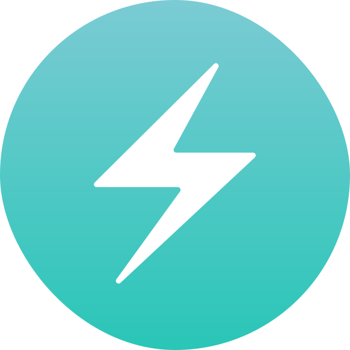
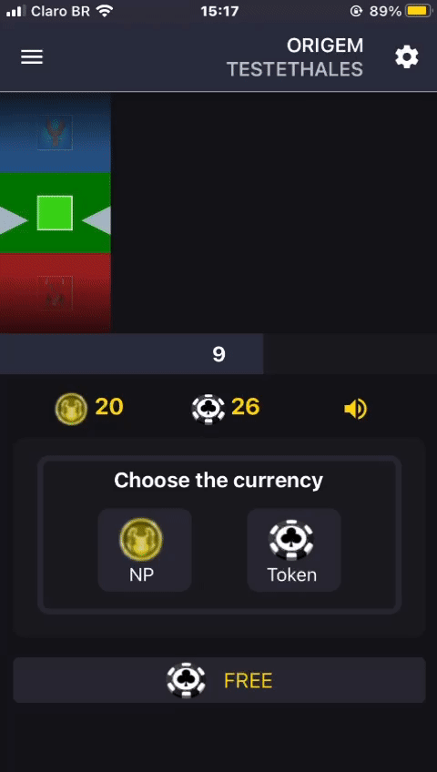

<table align= "center">
  <tr>
     <td align="center" width="140" height="112.43">
      
       React.js
    </td>
    <td align="center"  width="140" height="112.43">
      
       React Native
    </td>
    <td align="center"  width="140" height="112.43">
      
       JavaScript
    </td>
    <td align="center"  width="140" height="112.43">
      
       TypeScript
    </td>
    <td align="center"  width="140" height="112.43">
      
       Sass
    </td>
    <tr>
     <td align="center" width="140" height="112.43">
      
       GraphQL
    </td>
    <td align="center"  width="140" height="112.43">
      
       Next.js
    </td>
     
    <td align="center"  width="140" height="112.43">
      
       Firebase
    </td>
    <td align="center"  width="140" height="112.43">
      
       Styled-components
    </td>
    <td align="center"  width="140" height="112.43">
      
       Tailwind
    </td>
   </tr>
     <tr>
     <td align="center" width="140" height="112.43">
      
       Chakra UI
    </td>
    <td align="center"  width="140" height="112.43">
      
       Redux
    </td>
     
    <td align="center"  width="140" height="112.43">
      
       Context API
    </td>
    <td align="center"  width="140" height="112.43">
      
       Web3.js
    </td>
    <td align="center"  width="140" height="112.43">
      
       Ethers.js
    </td>
   </tr>
  </tr>
  
</table>
 

<!-- <table align= "center">
<td align="center"  width="240" height="112.43">
      
        Casino roulette Project   
  
</td>
  
</table>
-->

<table align= "center">
  <td align="center"  width="240" height="112.43">
   

  📫 You can reach me:
     

  <a href="https://www.linkedin.com/in/thalesbmc/">
   
   
  

</td>
</table>
 

 

    

 
 

 

<h2 align="center">Repositories</h2>

   

   

 

  

       
  

  
      
<h4 align="center" marginTop="40px">
  <a href="https://github.com/ThalesBMC?tab=repositories" title="Show Repositories">🔎 Show More 🔍</a>
 </h4>

 

